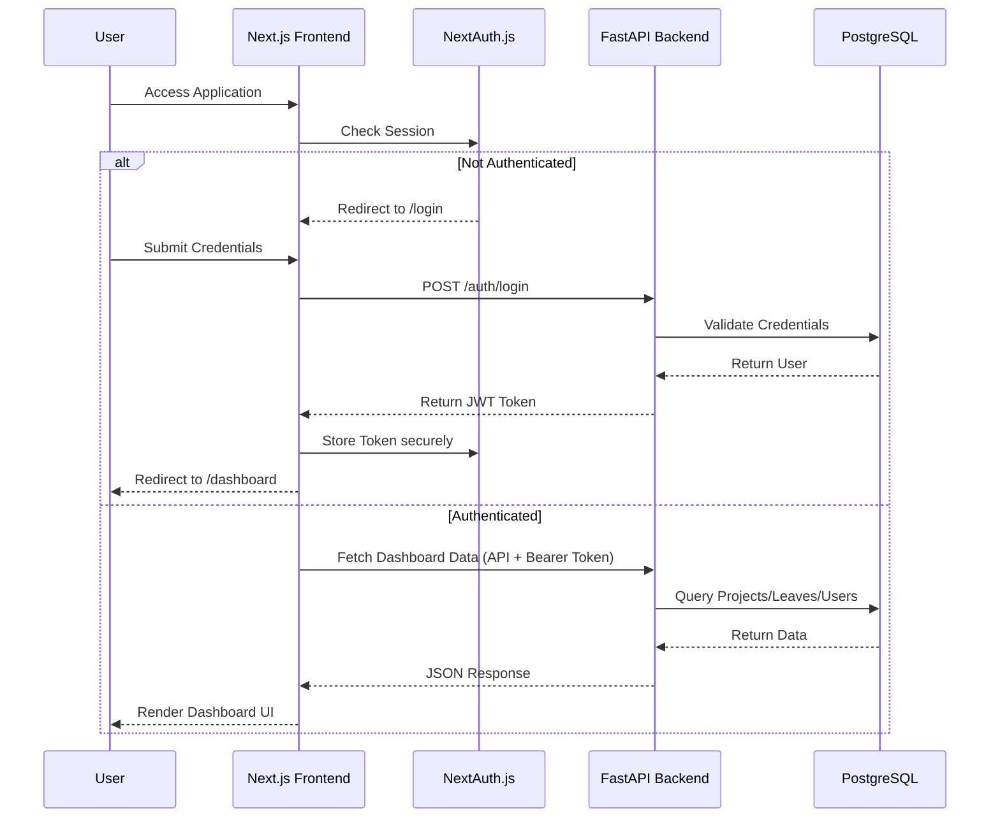
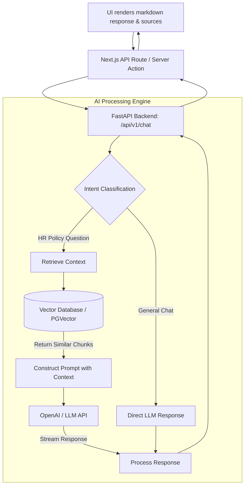

# AI HRMS Copilot - Frontend

This is the frontend application for the AI HRMS Copilot project, built with Next.js 14, Tailwind CSS, and Shadcn UI.

---

## 🔗 Quick Links & Deployments

- **Frontend Repository:** [https://github.com/kuralnithi/CB_A2_HRMS_FRNTD](https://github.com/kuralnithi/CB_A2_HRMS_FRNTD)
- **Backend Repository:** [https://github.com/kuralnithi/CB_A2_HRMS](https://github.com/kuralnithi/CB_A2_HRMS)
- **Frontend Deployed Link:** [https://cb-a2-hrms-frntd.vercel.app](https://cb-a2-hrms-frntd.vercel.app)
- **Backend Deployed Link:** [https://cb-a2-hrms.onrender.com/docs](https://cb-a2-hrms.onrender.com/docs)

> [!NOTE]
> **Render Server Spin-up:** The frontend communicates with the backend hosted on Render. To spin up the backend server on Render (as it may sleep due to inactivity), simply open the backend deployment URL in your browser.

---

## 🌟 Overview

The AI HRMS Copilot is a modern Human Resources Management System designed to streamline HR operations with the power of Artificial Intelligence. It provides distinct role-based dashboards (Admin, Manager, Employee) and features a smart AI Assistant capable of answering HR policy questions and navigating the platform.

## Gen AI Project

### HRMS

- [View the LinkedIn post for this HRMS project](https://www.linkedin.com/posts/kural-nithi-0b967122b_ai-generativeai-langchain-ugcPost-7465425438513938432-WNot/?utm_source=share&utm_medium=member_desktop&rcm=ACoAADmVtk0BmNqWq-K8895ZhmcAzBKhjfXB5oY)

### ✨ Key Features
- **Role-Based Access Control**: Different views and capabilities for Admins, Managers, and Employees.
- **Smart AI Copilot**: A context-aware chatbot that understands HR policies and can assist users dynamically.
- **Project & Leave Management**: Complete tracking of company projects, teams, and employee leave requests.
- **Support Tickets**: Internal ticketing system for HR requests.
- **Modern UI**: Built with Tailwind CSS and Shadcn for a premium, responsive, and dynamic user experience.

---

## 🏗️ System Architecture & Overall Flow

The system follows a standard Client-Server architecture with a dedicated AI processing layer on the backend.



---

## 🤖 AI Copilot Workflow

The AI Copilot is the standout feature of this HRMS, using Retrieval-Augmented Generation (RAG) to answer questions based on ingested HR documents.



---

## 🚀 Getting Started & Local Setup

Follow these simple, step-by-step instructions to set up the frontend application locally.

### 📋 Prerequisites

Before you start, ensure you have the following installed on your machine:
- **Node.js 18+**
- **npm, yarn, or pnpm**

---

### ⚙️ Step-by-Step Installation Guide

#### 1. Clone the Repository & Navigate to Frontend
If you haven't already, clone the repository and navigate into the `frontend` directory:
```bash
git clone https://github.com/kuralnithi/CB_A2_HRMS_FRNTD.git
cd CB_A2_HRMS_FRNTD/frontend
```

#### 2. Configure Environment Variables
We have provided a detailed template file containing all the configuration keys. Copy the `sample.env` to a new `.env.local` file:
```bash
cp sample.env .env.local
```
Now, open the `.env.local` file and update the variables to point to your backend API URL and specify your NextAuth configurations.

#### 3. Install Project Dependencies
Run the following command to install the required packages:
```bash
npm install
```

#### 4. Start the Next.js Development Server
Start the frontend development server:
```bash
npm run dev
```

---

### 🔍 Verification & Access

Once the server is running:
- **Local Application URL:** Open [http://localhost:3000](http://localhost:3000) in your browser to view the application.
- **Login Credentials:** Use the credentials seeded in the backend database (e.g., `admin@novaworks.local`, `manager@novaworks.local`, or `employee@novaworks.local` with password `password123`).

## 🛠️ Technology Stack
- **Framework**: [Next.js](https://nextjs.org/) (App Router)
- **Styling**: [Tailwind CSS](https://tailwindcss.com/)
- **Components**: [Shadcn UI](https://ui.shadcn.com/)
- **Authentication**: [NextAuth.js](https://next-auth.js.org/)
- **Icons**: [Lucide React](https://lucide.dev/)
