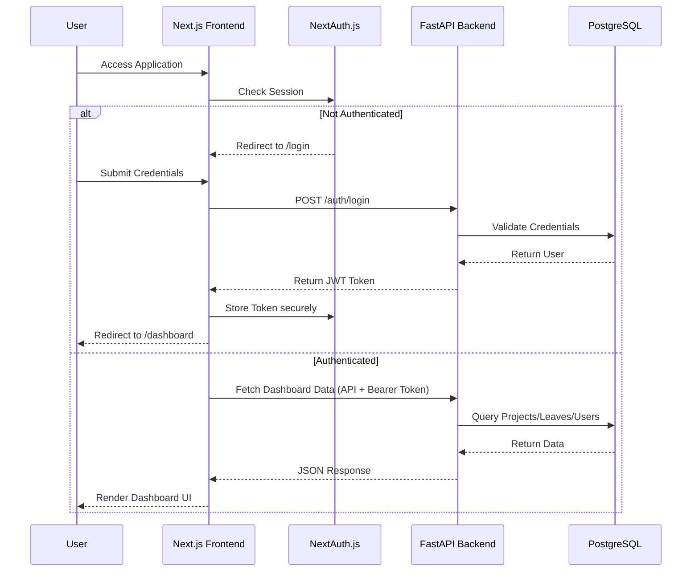
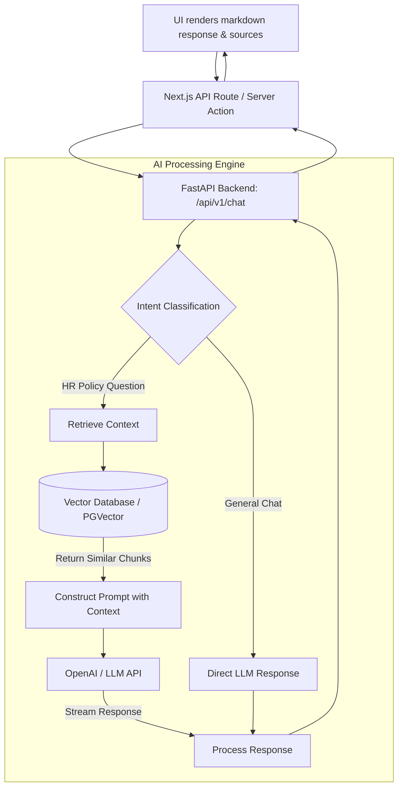

# AI HRMS Copilot - Frontend

This is the frontend application for the AI HRMS Copilot project, built with Next.js 14, Tailwind CSS, and Shadcn UI.

## 🌟 Overview

The AI HRMS Copilot is a modern Human Resources Management System designed to streamline HR operations with the power of Artificial Intelligence. It provides distinct role-based dashboards (Admin, Manager, Employee) and features a smart AI Assistant capable of answering HR policy questions and navigating the platform.

## Gen AI Project

### HRMS

- [View the LinkedIn post for this HRMS project](https://www.linkedin.com/posts/kural-nithi-0b967122b_ai-generativeai-langchain-ugcPost-7465425438513938432-WNot/?utm_source=share&utm_medium=member_desktop&rcm=ACoAADmVtk0BmNqWq-K8895ZhmcAzBKhjfXB5oY)

### ✨ Key Features
- **Role-Based Access Control**: Different views and capabilities for Admins, Managers, and Employees.
- **Smart AI Copilot**: A context-aware chatbot that understands HR policies and can assist users dynamically.
- **Project & Leave Management**: Complete tracking of company projects, teams, and employee leave requests.
- **Support Tickets**: Internal ticketing system for HR requests.
- **Modern UI**: Built with Tailwind CSS and Shadcn for a premium, responsive, and dynamic user experience.

---

## 🏗️ System Architecture & Overall Flow

The system follows a standard Client-Server architecture with a dedicated AI processing layer on the backend.



---

## 🤖 AI Copilot Workflow

The AI Copilot is the standout feature of this HRMS, using Retrieval-Augmented Generation (RAG) to answer questions based on ingested HR documents.



---

## 🚀 Getting Started

### Prerequisites
- Node.js 18+
- npm, yarn, or pnpm

### Installation

1. Clone the repository and navigate to the frontend folder.
2. Install dependencies:
   ```bash
   npm install
   ```
3. Set up your `.env.local` file:
   ```env
   NEXT_PUBLIC_API_URL=http://localhost:8000/api/v1
   NEXTAUTH_URL=http://localhost:3000
   NEXTAUTH_SECRET=your_super_secret_key
   ```
4. Run the development server:
   ```bash
   npm run dev
   ```

Open [http://localhost:3000](http://localhost:3000) with your browser to see the result.

## 🛠️ Technology Stack
- **Framework**: [Next.js](https://nextjs.org/) (App Router)
- **Styling**: [Tailwind CSS](https://tailwindcss.com/)
- **Components**: [Shadcn UI](https://ui.shadcn.com/)
- **Authentication**: [NextAuth.js](https://next-auth.js.org/)
- **Icons**: [Lucide React](https://lucide.dev/)
